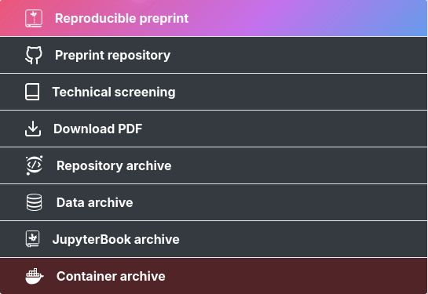
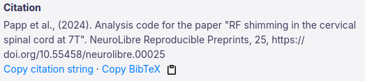

Article page
============

The first thing you will notice on a neurolibre living article page is a pdf summary of the article. This pdf is really simply a summary of the work.

Then next to it, you will find a series of links. These links are proper archives of all the necessary assets required to reproduce the article. This includes the data, the original code repository, the docker container with all the environment, as well as the thread with the technical screening of the living article.

Each asset has its own DOI, which is linked to the DOI of the living article. That DOI, along with a citation (available in plain text and bib format) are also available.

A badge with the DOI is available to insert on a github repo or a webpage.
