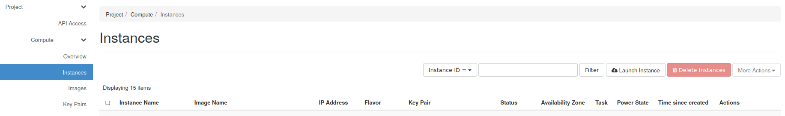
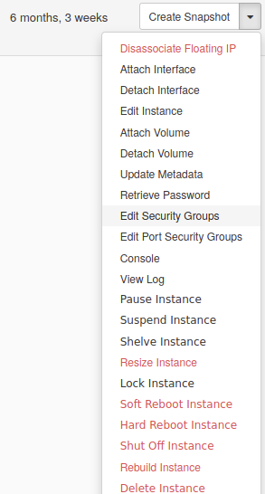

Bare-metal to local Docker registry and volumes
===============================================

Internet speed is the top-priority for our server.
We already experienced in the past slow internet speed on `Arbutus <https://docs.computecanada.ca/wiki/Cloud_resources#Arbutus_cloud_.28arbutus.cloud.computecanada.ca.29>`_
that caused us a lot of issues, specifically on the environment building phase.
The binderhub was stuck at the building phase, trying in vain to pull images from ``docker.io`` to our server.

.. note:: When the notebook was successfully created, slow internet is not an issue anymore because the interaction between the user and the binder instance is not demanding.

Among many `ideas <https://github.com/jupyterhub/binderhub/issues/864>`_, one of them that came up pretty quickly was to simply create our own local docker registry on arbutus. 
This would allow for low latency when pulling the images from the registry (connected to the local network where the binderhub resides).

The following documentation explains how we built our own docker registry on Arbutus, it is intended for developers who want to spawn a new ``Binderhub`` on another ``openstack`` host.
It contains also instructions on how to create volumes on ``openstack`` (for the ``Repo2Data`` databases) and attach them to the docker registry.

.. note:: It is still not the case, but in the future we expect the docker registry spawning to be part of the terrafrom configurations.

Instance spawning
-----------------

The first thing to do is to create a new instance on Arbutus using ``openstack``. 
It provides a graphical interface to interact with our openstack project from computecanada.

You will first need to `log-in into the openstack dashboard <https://arbutus.cloud.computecanada.ca/>`_.

.. note:: You can request the password to any infrastructure admin if authorized.

Now you can spawn a new instance under ``Compute/Instances`` with the ``Launch Instance`` button.

A new window will appear where you can describe the instance you want, the following fields are mandatories:

* :code:`Instance Name`: name of the instance, choose whatever you want
* :code:`Source`: OS image name used by the instance, select ``*Bionic-x64*``
* :code:`Flavor`: hardware configuration of the instance, ``c8-30gb-186`` is more than enough
* :code:`Key Pair`: list of the public ssh keys that will be allowed on the server, find the one that match the binderhub you created in :doc:`BAREMETAL_TO_BINDERHUB`

Click on ``Launch instance`` at the bottom when you finished.

External floating IP
--------------------

To access the instance from the outside, we need a ``public floating IP`` pointing to the instance.
If you don't already have one, you can allocate a new IP under ``Network/Floating IPs`` and by clicking to ``Allocate IP To Project``.

When it is done, click on the right of the instance under ``Compute/Instances`` to associate this new floating IP. 

.. warning:: You have a limited amount of floating IPs, so be carefull before using one.

Firewall
--------

Firewall rules will help you protect the instance against intruders and can be created on ``openstack`` via ``Security Groups``.

1. Create a new ``Security Group`` under ``Network/Security Groups``.
2. Click on ``Manage rules`` on the right and create an ``IPV4`` rule for all ``IP Protocol`` and ``Port Range``, with a ``Remote CIDR`` from your local network.
   
   For example, if the internal ``IP address`` from your instances is in the range ``192.167.70.XX``, the ``Remote CIDR`` would be ``192.167.70.0/24``.

   .. note:: Using a ``Remote CIDR`` instead of ``Security Group`` could be considered as unsafe. But in our case it is the easiest way to allow access, since all our binderhub instances uses the same private network.

3. Enable also the ports ``22 (SSH)``, ``80 (HTTP)`` and ``443 (HTTPS)``.
4. Update the ``Security Group`` under ``Compute/Instances``, and click on the right to select ``Edit Security Groups``.

You should now have ``ssh`` access for the ``ubuntu`` user on the instance

.. code:: console

   ssh ubuntu@<floating_ip>

.. warning:: If you cannot access the instance at this time, you should double check the public key and/or the firewall rules.
   It is also possible you hit some limit rate from compute canada, so retry later.

DNS specific considerations
---------------------------

We will need to secure the Docker registry through ``HTTPS`` to use it with ``Binderhub``, `it is not possible otherwise <https://github.com/jupyterhub/binderhub/issues/992>`_.

The Cloudflare DNS will defined the registry domain and provide the ``TLS`` certificate for us.

1. Log-in to `cloudflare <https://dash.cloudflare.com/login>`_

.. note:: You can request the password to any infrastructure admin if authorized.

2. Under the ``DNS`` tab, you have the option to create a new record

   .. image:: img/dns_registry.png

3. Create an ``A`` record with a custom sub-domain, and the ``IPV4`` address pointing to the floating IP from :ref:`External floating IP`.

Volumes creation
----------------

One feature of ``Neurolibre`` is to provide database access to the users of the ``Binderhub``, through user predefined `Repo2Data requirement file <https://github.com/SIMEXP/Repo2Data#input>`_.
These databases are stored into a specific volume on the Docker registry instance.

In the same time, another specific volume contains all the docker images for the registry.

These volumes will be created through ``openstack``.

1. Go under ``Volumes/Volumes`` tab
2. Click on ``Create a Volume`` and define the name of the volume and its storage size
3. Attach this volume to the Docker registry instance by clicking on the right of the instance under ``Compute/Instances``
4. Repeat the process from (1) to (3) to create the Docker registry image volume

Once the volumes are created on ``openstack``, we can ``ssh`` to the registry instance and mount the volumes:

1. Check that the volume(s) are indeed attached to the instance (should be ``/dev/vdc``):

   .. code:: console

      sudo fdisk -l

2. Now we can configure the disk to use it,

   .. code:: console

      sudo parted /dev/vdc
      mklabel gpt
      mkpart
      (enter)
      ext3
      0%
      100%
      quit

3. Check that the partition appears (should be ``/dev/vdc1``):

   .. code:: console

      sudo fdisk -l

4. Format the partition,

   .. code:: console

      sudo mkfs.ext3 /dev/vdc1

5. Create a directory and mount the partition on it:

   .. code:: console

      sudo mkdir /DATA
      sudo chmod a+rwx /DATA
      sudo mount /dev/vdc1 /DATA

6. Check if ``/dev/vdc1`` is mounted on ``/DATA``

7. Repeat all the steps from (1) to (6) for the Docker registry volume (name of directory would be ``/docker-registry``).

Docker registry setup
---------------------

After ``ssh`` to the instance, install Docker on the machine by following `the official documentation <https://docs.docker.com/install/linux/docker-ce/ubuntu/#install-docker-engine---community>`_.

We will now secure the registry with a password.
Create a directory ``auth`` and a new ``user`` and ``password``:

.. code:: console

   mkdir auth
   sudo docker run --entrypoint htpasswd registry:2.7.0 -Bbn user password > auth/htpasswd

Create also a folder that hold the registry content (for easier backup):

.. code:: console

  sudo mkdir /docker-registry

After that you can launch the registry,

.. code:: console

   sudo docker run -d -p 80:80 --restart=always --name registry \
   -v /docker-registry:/var/lib/registry \
   -v /home/ubuntu/auth:/auth -e "REGISTRY_AUTH=htpasswd" \
   -e "REGISTRY_AUTH_HTPASSWD_REALM=Registry Realm" \
   -e REGISTRY_AUTH_HTPASSWD_PATH=/auth/htpasswd \
   -e REGISTRY_HTTP_ADDR=0.0.0.0:80 \
   -e REGISTRY_STORAGE_DELETE_ENABLED=true \
   registry:2.7.0

.. warning:: ``/docker-registry`` is the Docker registry volume that we configured in :ref:`Volumes creation`.

Now the registry should be running, follow `this documentation <https://docs.docker.com/registry/deploying/#copy-an-image-from-docker-hub-to-your-registry>`_ to test it.

You can try it on your machine (or another instance).
You would first need to log-in to the Docker registry using the domain name you configure ``my-binder-registry.conp.cloud`` in :ref:`DNS specific considerations`:

.. code:: console

   sudo docker login my-binder-registry.conp.cloud --username user --password password
   sudo docker pull ubuntu:16.04
   sudo docker tag ubuntu:16.04 my-binder-registry.conp.cloud/my-ubuntu
   sudo docker push my-binder-registry.conp.cloud/my-ubuntu

.. note:: The Docker registry can be accessed through its `HTTP api <https://docs.docker.com/registry/spec/api/>`_. This is how you can delete images from the registry for example.

BinderHub considerations
------------------------

On each k8s node (including the worker), you will also need to log-in.
You may also need to add the docker config to the ``kubelet`` lib, so the docker registry
is properly configured on you kubernetes cluster.

.. code:: console

  sudo docker login my-binder-registry.conp.cloud --username user --password password
  cp /home/${admin_user}/.docker/config.json /var/lib/kubelet/