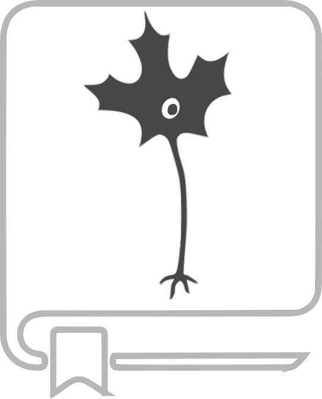

NeuroLibre
==========

.. warning:: NeuroLibre is at an alpha stage of development, and is not currently open for submissions.

NeuroLibre is a curated repository of interactive neuroscience notebooks that seamlessly integrates data, text, code and figures. Notebooks can be freely modified and re-executed through the web, offering a fully reproducible, “libre” path from data to figures. NeuroLibre is powered by the Binder project with computational resources provided by the Canadian Open Neuroscience Platform (CONP), CBRAIN, and Compute Canada.

